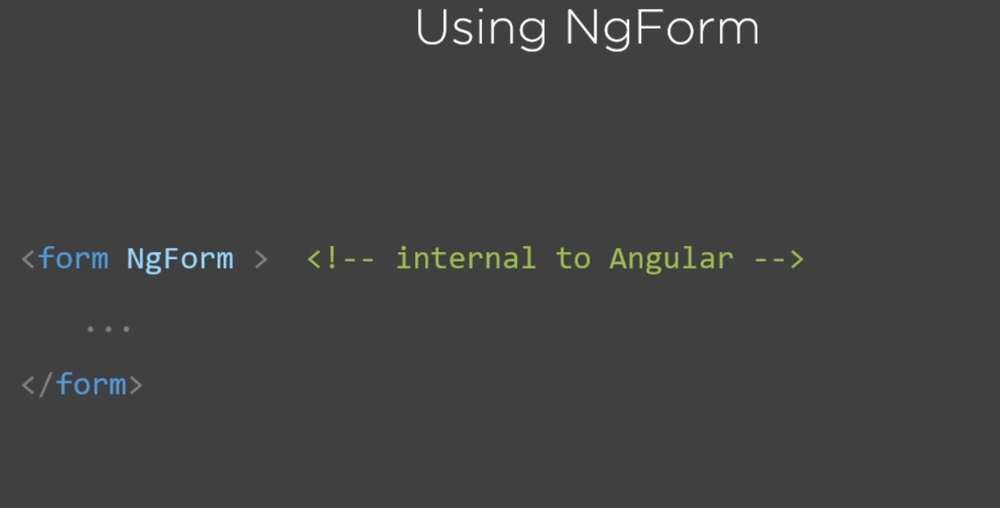

Remember to register the forms module in App Module, as this lets Angular take control of any form we hve in any template - without this, Angular wouldn't know anything about the forms we create in our template.

You have a plethora of HTML5 input types to use from.

### ngForm Directive
When we imported our forms module into our application, we let Angular take over our form by using the ngForm directive. This directive gives us valuable information about our form.

When Angular parses our template, it'll look for a form tag and add this directive, Angular will see this directive and create an instance of ngForm

### ngModel Directive
When building a fomr, the ngMOdel needs to be placed in every field we want Angular to know about, it helps us build the individual form control input's value object.
Note: for ngModel to work, you need a name attribute set for the input field.

### HTML5 Field Validation

ngNativeValidate will allow the browser to validate each control map. Angular turns this off by default because there are many differences between the various browsers

In the context of HTML field input elements, blur means lose focus, like tabbing off the field or hitting a submit button to cause the field to lose focus.

### Validation classes in Angular

ng-untouched - before blur
ng-touched - after blur

ng-pristine - before modification of field value
ng-dirty - after modification of field value

ng-valid, ng-invalid - based on the other field's attribute validation values

### Classes and Associated and NgModel Properties

ngSubmit

